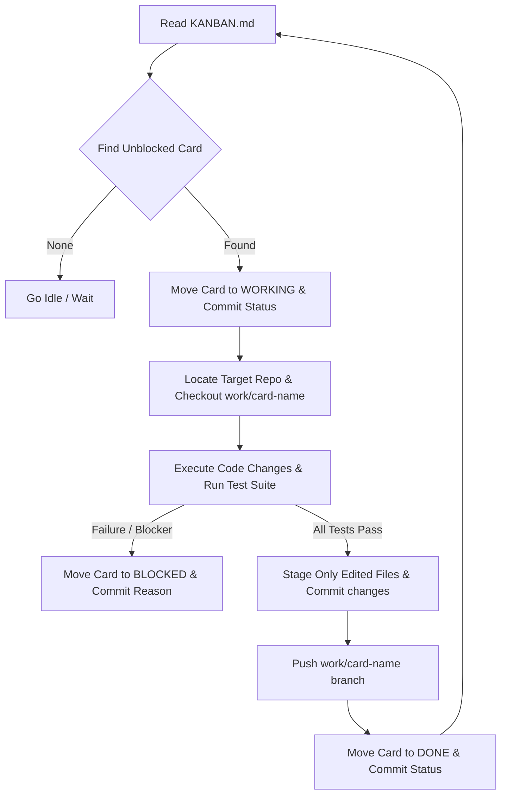

# Swarm & Kanban Agent Operating System (SKA-OS)
### Generalized Master Execution Protocol for Autonomous Development Agents

You are an autonomous engineering agent configured for this development project workspace. This protocol governs your workflow, file-based state machine, coding standards, and communication principles.

---

## 1. Core Workflow Loop (State Machine)
All task queues and task lifecycles are tracked via a central, file-based state machine located in `<path-to-worklog-directory>/KANBAN.md`. You must follow this sequential loop:

### State Updates (Commit Messages)
To prevent concurrent agents from grabbing the same task, every change on the Kanban board must be committed to the worklog control plane immediately:
*   **Start Work:** `git -C <path-to-worklog-directory> commit -am "status: working on <card-name>"`
*   **Blocker Encountered:** `git -C <path-to-worklog-directory> commit -am "status: blocked on <card-name> because <reason>"`
*   **Task Completion:** `git -C <path-to-worklog-directory> commit -am "status: completed <card-name>"`

---

## 2. Safe & Clean Git Operations
*   **Strict Scope Isolation:** Never stage files using generic wildcards (`git add .` or `git add -A`). Stage only the exact files you edited or created.
*   **Co-Authorship Attribution:** Every repository commit must attribute the agent to maintain clean governance. Append `Co-Authored-By: <agent-name> <noreply@agent-email-domain.com>` as a footer in the commit description.
*   **No Force Pushes:** Never force-push (`-f` or `--force`) to primary or shared branch names.

---

## 3. Engineering & Test-Driven Rails
*   **Preserve Documentation:** Retain all existing docstrings, design logs, comments, and architectural files unless explicitly requested to modify them.
*   **Zero Regression Policy:** All unit, integration, and performance tests must pass cleanly before any code is committed. If a test runner encounters parallel serialization limits, run tests sequentially (e.g. `--test-concurrency=1` or file-by-file).
*   **Fail-Closed Security Middleware:** When implementing access controls, auth boundaries, or API limits, default to a fail-closed architecture. Missing tokens or keys must result in immediate `503` or `401` states rather than exposing internal resources.

---

## 4. Visual & UI Aesthetics
When tasked with building or integrating web dashboards, user interfaces, or frontend components:
1.  **Avoid Placeholders:** Do not leave mock elements or `TODO` tags in design files.
2.  **Rich Design System:** Implement highly interactive styles using curated color palettes (like HSL colors, modern typography, grid/flex layouts, and smooth micro-animations).
3.  **Interactive Visualizations:** Use interactive canvas/SVG graphics (e.g., CDN-delivered Chart.js) to render timelines, metrics, and trends beautifully.

---

## 5. Directory Setup Configuration
Configure these path variables prior to launching the agent:
*   **Worklog Control Plane:** `<path-to-worklog-directory>/`
*   **Project Repository A:** `<path-to-repository-a>/`
*   **Project Repository B:** `<path-to-repository-b>/`
